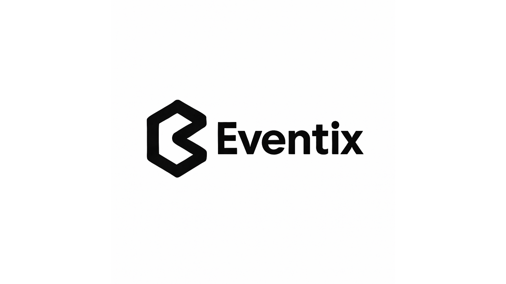

<div align="center">

[](https://git.io/typing-svg)

<br/>



**ONE PLACE FOR EVERY PURPOSE**


---

</div>

## 📌 About the Project

**Eventix** is a **centralized event registration system** designed to seamlessly manage **sports and non-sports events** for all participants.
It replaces manual tracking with a **clean, user-friendly, and scalable digital solution**.

---

## ✨ Features

### 🔐 Authentication & Roles
- Multi-role system: **Admin**, **Event Head (Organizer)**, and **Participant**
- Session-based authentication with role protection on all pages

### 📋 Event Registration
- 🔗 **Centralized Registration** – Manage all events in one place
- 🏃 **Supports Sports & Non-Sports** – From tournaments to seminars
- 👥 **Inclusive Design** – Easy to use for all participants
- 📅 **Smart Scheduling** – Auto-assigns tables/seat numbers
- 🔒 **Registration Guard** – Blocks registration for past/ended events automatically

### 📊 Dashboards
- **Admin Dashboard** – Real-time insights on events & participants
- **Event Head Hub** – Quick-action cards for managing events, reports, and announcements
- **Participant Dashboard** – Personal event overview with QR code access

### 📅 Event Management (Event Head)
- Create, edit, and delete events
- View **attendance reports**, **participant engagement**, and **inactive tracking**
- Send **email reminders** (3-day, 1-day, day-of) to registered participants
- Send **custom announcements** to all confirmed participants with history log
- View **announcement history** per event

### ✅ Attendance System
- **Check-in / Check-out** per event with time tracking
- **Auto-close missed checkouts** – if a participant checked in but never checked out before the event ended, the system automatically sets check-out time to the event end time and marks a note: *"Left without checking out"*
- **Attendance locked** for participants who never checked in to ended events (marked absent)
- Status cards: ✅ Complete, ⚠️ Left without checking out, 🔒 Absent/Locked

### 📆 Event Calendar
- Monthly calendar view with event pills per day
- Click any event to view details in a modal
- Previous / Next month navigation

### 🔍 Filter & Search
- **Filter dropdown** on Browse Events, My Events, and Attendance pages — filter by All / Upcoming / Past
- **Real-time search bar** — filters cards instantly by event name and venue (no page reload)
- **No-results state** with contextual empty message

### 📱 Responsive Design
- Fully responsive across all device sizes: large desktop, laptop, tablet landscape, tablet portrait, phone, and small phone
- Sidebar, banners, cards, tables, modals, and filter controls all adapt cleanly

### 🎫 QR Code System
- Each registration generates a unique QR code
- QR codes are **disabled for past events** — replaced with a locked placeholder and status badge
- Participants can view and download their QR code from My Events

### 📧 Email Notification System (PHPMailer + Gmail SMTP)
- Automated reminders sent at 3 days, 1 day, and day-of the event
- Custom announcement emails composed and sent by Event Heads
- Deduplication via `email_log` table — no duplicate reminders sent
- Announcements tracked separately in `announcement` table with full history

---

## 🧰 Tech Stack

### Backend


### Frontend


### Database


### Tools


---

## 🗂️ Database Tables

| Table | Purpose |
|-------|---------|
| `user` | Stores all users with role (admin, event_head, participant) |
| `event` | Event details — title, venue, times, capacity, price |
| `venue` | Venue names linked to events |
| `registration` | Participant registrations per event with table number and status |
| `attendance` | Check-in/check-out times, status, and notes per registration |
| `email_log` | Tracks sent reminder emails to prevent duplicates |
| `announcement` | Stores sent announcements per event with subject, message, and sender |

---

## 🗓️ Project Timeline

- **Project Timeline:** [Eventix - Project Timeline](https://www.notion.so/Project-Timeline-2ad3fa52b79c8170b4d3e9276c72eff6)

---

## 🏛️ Admin Access

The administrative interface can be accessed at:

```
localhost/Registration-System/eventsys/codes/php/admin/admin-login.php
```

---

## ⚡ Installation / Usage

1. Clone this repository:
   ```bash
   git clone "git@github.com:relente-patriciajoy/Registration-System.git"
   ```

2. Place the project folder inside `htdocs` (XAMPP):
   ```
   C:/xampp/htdocs/Registration-System/
   ```

3. Import the database:
   - Open **phpMyAdmin** → Create database `event_registration`
   - Import `event_registration.sql`

4. Start **Apache** and **MySQL** in XAMPP Control Panel

5. Open in your browser:
   ```
   http://localhost/Registration-System/eventsys/codes/php/
   ```

---

## 📁 Project Structure

```
Registration-System/
└── eventsys/
    └── codes/
        ├── assets/          # Images and logos
        ├── css/             # style.css, sidebar.css, calendar.css, event_head.css
        ├── includes/        # db.php, session.php, role_protection.php, notification_function.php
        ├── js/              # calendar.js and other scripts
        └── php/
            ├── admin/       # Admin login and dashboard
            ├── auth/        # Login, register, logout
            ├── calendar/    # calendar.php
            ├── components/  # sidebar.php
            ├── dashboard/   # events.php, my_events.php, attendance.php
            ├── event/       # event_register.php, announcement.php, view_attendance.php,
            │                # reports.php, participant_engagement.php, inactive_tracking.php
            └── qr/          # view_qr.php
```

---

## 👤 Developer

| Avatar | Name | Role |
|--------|------|------|
|  | **Patricia Joy Relente** |  |

> Designed, built, and maintained entirely by Patricia Joy Relente —
> from database schema and backend logic to frontend UI and responsive design.

---

<div align="center">


*Built with 💙 by Patricia Joy Relente*

</div>
